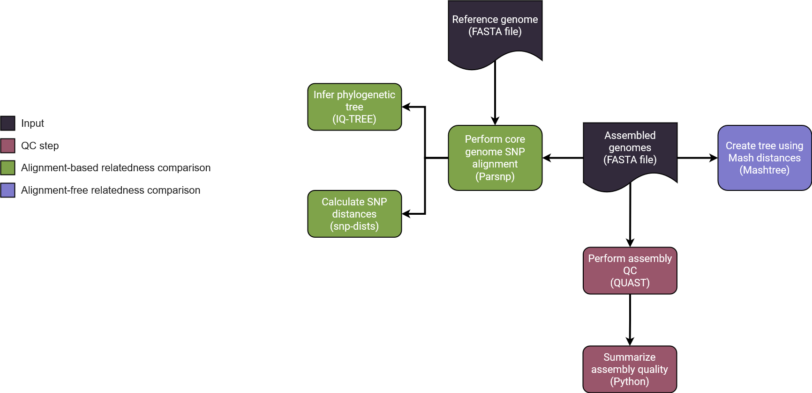

## Introduction


**wslh-bio/dryad** is a NextFlow pipeline to construct reference free core-genome historical  or SNP phylogenetic trees for examining prokaryote relatedness in outbreaks. Dryad performs both a reference free core-genome analysis based off of the approach outlined by Oakeson et. al and/or a SNP analysis using Parsnp and Mashtree.


Dryad processes fasta files that have been processed either by [Spriggan](https://github.com/wslh-bio/spriggan) or by [Phoenix](https://github.com/CDCgov/phoenix). Dryad is split into two major workflows:
1. A workflow dedicated to fine scale outbreak investigations that are within a singular outbreak.
2. A workflow dedicated to identifying historical relatedness across multiple years and multiple outbreaks.  



1. Universal Steps
   - Enter assembled FASTA genomes into a samplesheet. 
   - If Phoenix was not run, Quast is used to determine assembly quality control.
   - The Quast results are summarized with a custom python script to increase readability.
2. Alignment
   - Historical Comparison
      - Mashtree generates a phylogenetic tree using Mash distances
   - Fine scale Comparison
      - Parsnp is used to perform a core genome alignment.
      - IQ-TREE is used for inferring a phylogenetic tree.
      - Snp-dists is used to calculate the SNP distance matrix.


## Usage

> [!NOTE]
> If you are new to Nextflow and nf-core, please refer to [this page](https://nf-co.re/docs/usage/installation) on how to set-up Nextflow. Make sure to [test your setup](https://nf-co.re/docs/usage/introduction#how-to-run-a-pipeline) with `-profile test` before running the workflow on actual data.

First, prepare a samplesheet with your input data that looks as follows:

`samplesheet.csv`:

```csv
sample,fasta
sample_1,2024_1.contigs.fa
sample_2,2024_2.contigs.ga
```

Each row represents a fasta file.

If you would like to run an alignment free comparison, use:

```bash
nextflow run wslh-bio/dryad \
   -profile <docker/singularity/.../institute> \
   --input samplesheet.csv \
   --outdir <OUTDIR> \
```
By default, Dryad runs an alignment free comparison if nothing is specified. 

If you would like to run an alignment based comparison, use:

```bash
nextflow run wslh-bio/dryad \
   -profile <docker/singularity/.../institute> \
   --input samplesheet.csv \
   --outdir <OUTDIR> \
   --fasta <REFERENCE_FASTA> \
   --alignment_based 
```

> [!WARNING]
> Please provide pipeline parameters via the CLI or Nextflow `-params-file` option. Custom config files including those provided by the `-c` Nextflow option can be used to provide any configuration _**except for parameters**_;
> see [docs](https://nf-co.re/usage/configuration#custom-configuration-files).

## Credits

wslh-bio/dryad was originally written by Dr. [Kelsey Florek](https://github.com/k-florek). It has since been worked on by Dr. [Abigail Shockey](https://github.com/AbigailShockey) and [Eva Gunawan](https://github.com/evagunawan).

We thank the following people for their extensive assistance in the development of this pipeline:

## Contributions and Support

If you would like to contribute to this pipeline, please see the [contributing guidelines](.github/CONTRIBUTING.md).

## Citations

<!-- TODO nf-core: Add citation for pipeline after first release. Uncomment lines below and update Zenodo doi and badge at the top of this file. -->
<!-- If you use wslh-bio/dryad for your analysis, please cite it using the following doi: [10.5281/zenodo.XXXXXX](https://doi.org/10.5281/zenodo.XXXXXX) -->

<!-- TODO nf-core: Add bibliography of tools and data used in your pipeline -->

An extensive list of references for the tools used by the pipeline can be found in the [`CITATIONS.md`](CITATIONS.md) file.

This pipeline uses code and infrastructure developed and maintained by the [nf-core](https://nf-co.re) community, reused here under the [MIT license](https://github.com/nf-core/tools/blob/master/LICENSE).

> **The nf-core framework for community-curated bioinformatics pipelines.**
>
> Philip Ewels, Alexander Peltzer, Sven Fillinger, Harshil Patel, Johannes Alneberg, Andreas Wilm, Maxime Ulysse Garcia, Paolo Di Tommaso & Sven Nahnsen.
>
> _Nat Biotechnol._ 2020 Feb 13. doi: [10.1038/s41587-020-0439-x](https://dx.doi.org/10.1038/s41587-020-0439-x).
