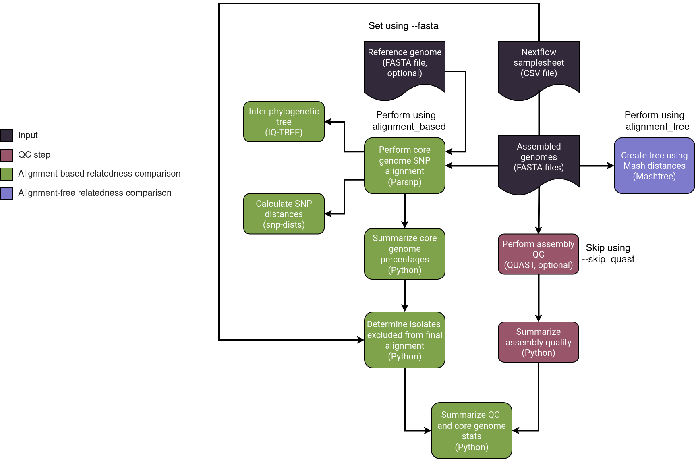

## Dryad


**Dryad** is a [Nextflow](https://www.nextflow.io/) pipeline for examining prokaryote relatedness. Dryad can perform a reference free analysis and/or SNP analysis.

Dryad analyzes fasta files that have been processed either by [Spriggan](https://github.com/wslh-bio/spriggan) or by [PHoeNIx](https://github.com/CDCgov/phoenix). Dryad is split into two major workflows:
1. A workflow dedicated to fine scale outbreak investigations that are within a singular outbreak. This process uses a reference to determine relatedness and snp distances. The reference can be removed from the alignment based workflow to create a phylogenetic tree that gives a high resolution look at a singular outbreak.
2. A workflow dedicated to identifying historical relatedness across multiple years and multiple outbreaks without the use of a reference. This alignment free workflow gives a low resolution look at historical relatedness.

## Table of Contents:
[Usage](#usage)  
[Input](#input)  
[Parameters](#parameters)  
[Workflow](#workflow)  
[Output](#output)  
[Credits](#credits)  
[Contributions-and-Support](#contributions-and-support)  
[Citations](#citations)  

## Usage
> [!NOTE]
> If you are new to Nextflow and nf-core, please refer to [this page](https://nf-co.re/docs/usage/installation) on how to set-up Nextflow. Make sure to [test your setup](https://nf-co.re/docs/usage/introduction#how-to-run-a-pipeline) with `-profile test` before running the workflow on actual data. To use Dryad, a Nextflow minimum version of 24.04.2.5914 is needed.

To run an alignment free comparison, use:

```bash
nextflow run wslh-bio/dryad \
   -latest \
   -profile <docker/singularity/.../institute> \
   --input samplesheet.csv \
   --outdir <OUTDIR> \
   --alignment_free
```

Alternatively, to run an alignment based comparison, use:

```bash
nextflow run wslh-bio/dryad \
   -latest \
   -profile <docker/singularity/.../institute> \
   --input samplesheet.csv \
   --outdir <OUTDIR> \
   --fasta <REFERENCE_FASTA | random> \
   --alignment_based 
```

To run both and alignment based and an alignment free comparison, use:
```bash
nextflow run wslh-bio/dryad \
   -latest \
   -profile <docker/singularity/.../institute> \
   --input samplesheet.csv \
   --outdir <OUTDIR> \
   --fasta <REFERENCE_FASTA | random> \
   --alignment_based \
   --alignment_free
```

* Nextflow caches previously run pipelines. This can result in an older version of a pipeline being utilized. To get the most up-to-date version of a pipeline like Dryad, use the `-latest` tag.

## Input
Prepare a samplesheet with your input data with each row representing one fasta file. The samplesheet will look as follows:

`samplesheet.csv`:  
| sample | fasta |
| ------------- | ------------- | 
| sample_1 | 2024_1.contigs.fa |
| sample_2 | 2024_2.contigs.fa |

## Parameters
Dryad's main parameters and their defaults are shown in the table below:

| Parameter | Parameter description and defaults | Example usage |
| ------------- | ------------- | ------------- |
| input | Path to comma-separated file containing information about the samples in the experiment | --input <PATH_TO_SAMPLESHEET> |
| outdir | Output directory where the results will be saved. Absolute path must be used for storage on cloud infrastructure | --outdir <DESIRED_OUTPUT_PATH> |
| profile | Denotes how to access containerized software. | -profile aws |
| fasta | Reference fasta used for alignment based comparisons. Default is no reference fasta. | --fasta <PATH_TO_REF_FASTA> |
| fasta random | Reference fasta used for alignment based comparisons is chosen by Parsnp's algorithm. Default is not to use a random fasta file as a reference. | --fasta random |
| alignment_based | Performs a fine scale analysis within a singular outbreak | --alignment_based |
| alignment_free | Performs a historical analysis across multiple years and outbreaks | --alignment_free |
| task.cpus | Denotes how many cpus to use for Mashtree. Default task.cpus is 2. |--task.cpus 4 |
| cg_tree_model | Tells IQ-TREE what [model](http://www.iqtree.org/doc/Substitution-Models) to use. Default cg_tree_model is GTR+G | --cg_tree_model "GTR+G" |
| parsnp_partition | Tells parsnp the minimum partition amount or to not partition. Default is --no-partition.* | --parsnp_partition "--min-partition-size 50" |
| skip_quast | If the data was run through pheonix or another pipeline with a quality check, skips QUAST and the summary options. Default is to run QUAST as if quality summaries were not previously run. | --skip_quast |
| add_reference | Used to include reference in outputs. This option should not be used if you are using --fasta random. Default is false | --add_reference |

*If you are running an alignment based workflow on >100 samples, it may be beneficial to take into account a higher partitioning value than the default of 100. More information can be found in parsnp 2.0's [paper](https://pubmed.ncbi.nlm.nih.gov/38352342/#:~:text=Parsnp%20v2%20provides%20users%20with,combined%20into%20a%20final%20alignment.).

## Workflow


### 1. Universal Steps
   - Enter assembled FASTA genomes into a samplesheet. 
   - [QUAST v5.2.0](http://bioinf.spbau.ru/quast) is used to determine assembly quality if skip_quast is not indicated.
   - QUAST results are summarized with a custom python script to increase readability.
   
### 2. Comparison Steps
   - Historical Comparison
      - [Mashtree v1.4.6](https://github.com/lskatz/mashtree) generates a phylogenetic tree using Mash distances. 
   - Fine scale Comparison
      - **Bootstrapping in IQ-TREE2 requires at least 4 genomes. If less than 4 genomes are used, IQ-TREE2 will not perform bootstrapping.**
      - [Parsnp v2.0.5](https://github.com/marbl/parsnp) is used to perform a core genome alignment.
      - [IQ-TREE2 v2.3.4](https://github.com/Cibiv/IQ-TREE) is used for inferring a phylogenetic tree.
      - [Snp-dists v0.8.2](https://github.com/tseemann/snp-dists) is used to calculate the SNP distance matrix.

## Output
An example of Dryad's output directory structure for both alignment based and alignment free steps can be seen below. These directories will not include QUAST if `--skip_quast` is used:
```
alignment_based_output/
├── compare
│   └── sample_exclusion_status.csv
├── dryad
│   └── dryad_summary.csv
├── iqtree
│   └── parsnp.snps.mblocks.treefile
├── parse
│   └── aligner_log.tsv
├── parsnp
│   └── parsnp_output
│       ├── config
│       │   ├── all.mumi
│       │   └── all_mumi.ini
│       ├── log
│       │   ├── harvest-mblocks.err
│       │   ├── harvest-mblocks.out
│       │   ├── parsnp-aligner.err
│       │   ├── parsnpAligner.log
│       │   ├── parsnp-aligner.out
│       │   ├── parsnp-mumi.err
│       │   ├── parsnp-mumi.out
│       │   ├── raxml.err
│       │   └── raxml.out
│       ├── parsnpAligner.ini
│       ├── parsnp.ggr
│       ├── parsnp.maf
│       ├── parsnp.snps.mblocks
│       ├── parsnp.tree
│       ├── parsnp.xmfa
│       └── *.fna.ref
├── pipeline_info
│   ├── execution_report_*.html
│   ├── execution_timeline_*.html
│   ├── execution_trace_*.txt
│   ├── pipeline_dag_*.html
│   └── samplesheet.valid.csv
├── quast
│   ├── *.quast.report.tsv
│   ├── *.transposed.quast.tsv
│   ├── quast_results.tsv
├── sample
│   └── count.txt
└── snpdists
    └── snp_dists_matrix.tsv
```

```
alignment_free_output/
├── mashtree
│   └── mashtree.bootstrap.dnd
├── pipeline_info
│   ├── *.html
│   ├── *.txt
│   └── samplesheet.valid.csv
└── quast
    ├── *.quast.report.tsv
    ├── *.transposed.quast.report.tsv
    └── quast_results.tsv
```
Notable output files:

**Alignment based**  
| File | Output |
| ------------- | ------------- |
| quast_results.tsv* | Assembly quality results |
| snp_dists_matrix.tsv | Number of SNP distances between each pair of isolates |
| parsnp.snps.mblocks.treefile | Maximum likelihood phylogenetic tree |
| aligner_log.tsv | Coverage statistics calculated by parsnp |
| excluded_samples_from_parsnp.txt | Lists samples that were excluded from parsnp's analysis due to a MUMi distance > 0.01 |
| dryad_summary.csv | Summarizes quast report, if run, and core genome percentages |

*QUAST results will not be present if `--skip_quast` was used.

**Alignment free**
| File | Output |
| ------------- | ------------- |
| quast_results.tsv* | Assembly quality results |
| mashtree.bootstrap.dnd | Neighbor joining tree based on mash distances |

*QUAST results will not be present if `--skip_quast` was utilized.

> [!WARNING]
> Please provide pipeline parameters via the CLI or Nextflow `-params-file` option. Custom config files including those provided by the `-c` Nextflow option can be used to provide any configuration _**except for parameters**_;
> see [docs](https://nf-co.re/usage/configuration#custom-configuration-files).

## Credits
Dryad was written by Dr. [Kelsey Florek](https://github.com/k-florek), Dr. [Abigail C. Shockey](https://github.com/AbigailShockey), and [Eva Gunawan](https://github.com/evagunawan).

We thank the bioinformatics group at the Wisconsin State Laboratory of Hygiene for all of their contributions. 

## Contributions and Support
If you would like to contribute to this pipeline, please see the [contributing guidelines](.github/CONTRIBUTING.md).

## Citations
If you use Dryad for your analysis, please cite it using the following:

`K. Florek, A.C. Shockey, & E. Gunawan (2014). Dryad (Version 4.1.0) [https://github.com/wslh-bio/dryad].`

An extensive list of references for the tools used by Dryad can be found in the [`CITATIONS.md`](CITATIONS.md) file.

This pipeline uses code and infrastructure developed and maintained by the [nf-core](https://nf-co.re) community, reused here under the [MIT license](https://github.com/nf-core/tools/blob/master/LICENSE).

> **The nf-core framework for community-curated bioinformatics pipelines.**
>
> Philip Ewels, Alexander Peltzer, Sven Fillinger, Harshil Patel, Johannes Alneberg, Andreas Wilm, Maxime Ulysse Garcia, Paolo Di Tommaso & Sven Nahnsen.
>
> _Nat Biotechnol._ 2020 Feb 13. doi: [10.1038/s41587-020-0439-x](https://dx.doi.org/10.1038/s41587-020-0439-x).

